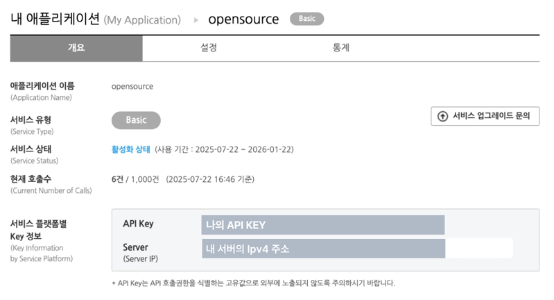
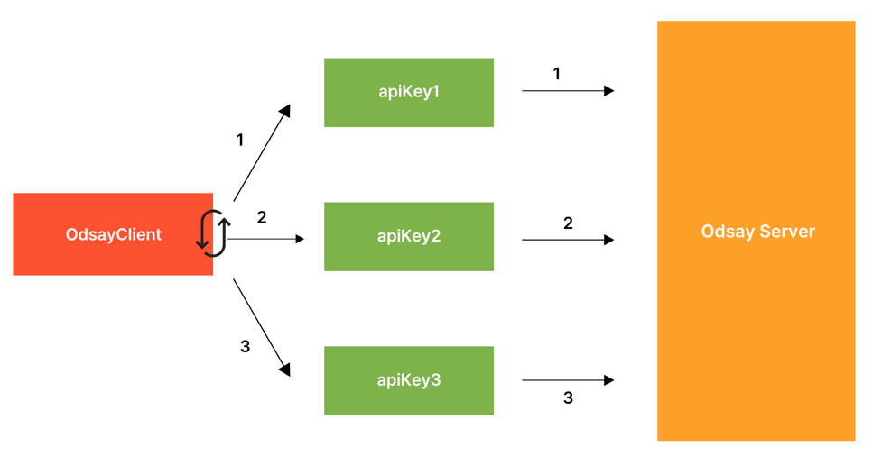

# Odsay-Utils

## 설명
오디세이 API를 활용하여 대중교통을 이용하여 두 좌표간 이동 시, 최단 시간(분)을 반환합니다.

## 사용방법

### step1. 의존성 추가

- 현재 버전에서는 `java 17` 기준 프로젝트에만 호환됩니다.
- build.gradle에서 의존성을 추가합니다.

```groovy
implementation 'io.github.coli-geonwoo:odsay-utils:X.X.X'
```

### step2. 오디세이 API 등록
- [ODsay API](https://lab.odsay.com/)에 회원가입합니다
- 애플리케이션 등록 후, Server IP에 나의 IPv4 주소를 등록합니다



### step3. OdsayRouteClient 사용
- 출발지, 도착지의 Coordinates 좌표 객체를 넘기면 대중교통 최단 소요시간(분)이 반환됩니다.
ex)
```java
    public void test() {
        Coordinates origin = new Coordinates("37.505419", "127.050817");
        Coordinates target = new Coordinates("37.515253", "127.102895");

        long minutes = odsayRouteClient.calculateRouteMinutes(apiKey, origin, target);

        assertThat(minutes).isEqualTo(15);
    }
```

## 25.09.21 v1.1.0 업데이트

### 계정 로드밸런싱 기능 추가

- Odsay는 1초당 호출가능한 건수에 제한이 있습니다.
- 이에 따라 서비스 가용량에 맞도록 apiKey를 등록하여 계정을 로드밸런싱할 수 있는 기능을 업데이트하였습니다.
- 사용법은 간단합니다. client 초기화 시 apiKey를 여러개 넣어두면, 요청에 따라 로드밸런싱하여 요청을 분산시킵니다.
```java

public void init(RestClient restClient) {
    
    OdsayRouteClient odsayRouteClient = new OdsayRouteClient(restClient, apikey1, apiKey2, apiKey3);
}

```



### apiKey 에러 개선

- apiKey에 '+'가 포함되어 있으면 에러가 발생하는 문제가 있었습니다.
- URLEncoder를 활용하여 해당 에러를 픽스하였습니다.

```java
 public long calculateRouteMinutes(String apiKey, Coordinates origin, Coordinates target) {
    String encodedApiKey = URLEncoder.encode(apiKey, StandardCharsets.UTF_8);
    OdsayResponse response = getOdsayResponse(encodedApiKey, origin, target);
    return responseToRouteTime(response);
  }
```

### OdsayRouteClient 에러객체
| Exception                   | Description                   |
|-----------------------------|-------------------------------|
| OdsayException              | 오디세이 Util에서 발생가능한 최상위 에러. ㅐㄱ체 |
| OdsayUtilException          | 오디세이 서버 자체 에러                 |
| OdsayWrongApiKeyException   | apiKey 에러 or IP 미등록           |
| OdsayClosestPlaceException  | 출발지와 도착지가 700m 이내일 때          |
| OdsayTooManyRequetException | 1초당 허용가능한 호출량을 초과했을 때         |
| OdsayBadRequestException    | wrong input value             |


